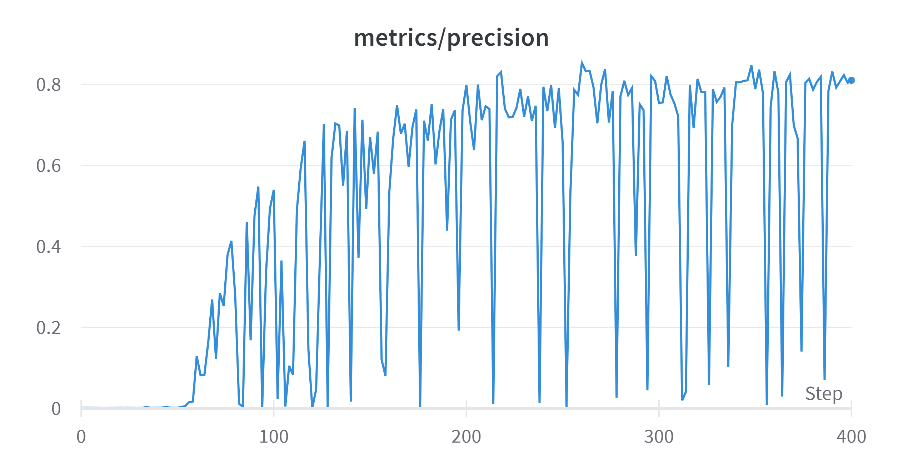
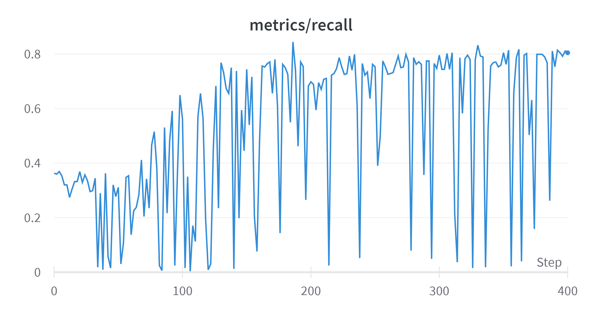
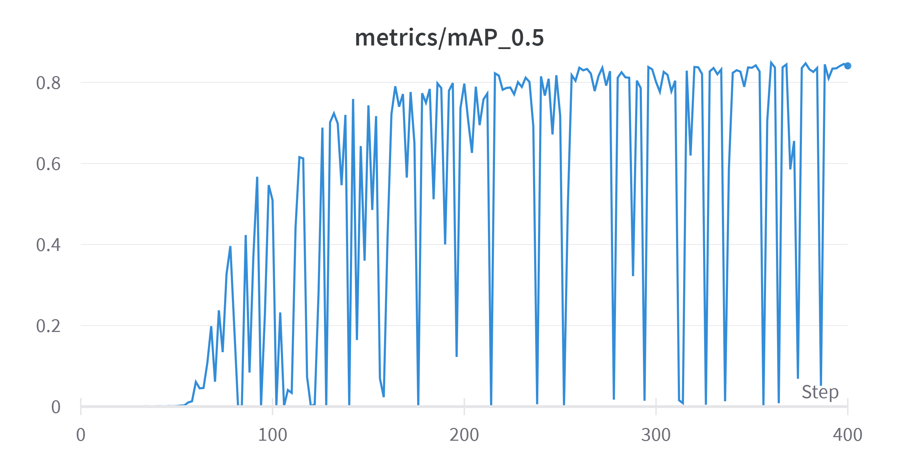

# Signature Detection Using YOLOv5

> Welcome to RBS Associates Law firm, where every piece of paper that comes into the firm needs to be signed by one ore more people for legal reasons and rules of the law firm. 
>
> The Tech team at the law firm (which is me) was tasked with creating a system that will take the scanned images of the documents (pictures essentially taken via a phone or scanned via a scanner) and detect if there are signatures in the images.

***

## How to use the Application?
>Well that's quite simple actually. Just go to [Sign-Detect-API](https://sign-detect-api.azurewebsites.net). Once you are there you should see somthing like ```{'hello':'world'}```. If you see this then the web app is working correctly. 
>
>Then to run inference on image url's, you just need to go to the address bar and run inferences like
```
https://sign-detect-api.azurewebsites.net/img?q=URL
```
>Here, ```/img?q=URL``` is the end-point where we will run the inferences. Replace the URL with the image of the URL that you will be using for inference. 

***

## Overview

Now a days it is very common for law firms to have a digital record for every piece of paper they receive and it is essential for them to have signatures on each piece of paper they receive to keep track of who received what document because it could be something confidential related to a case that the firm might be working on.

So, instead of a human looking through each digital document, why not let the computer do the hard work in looking through each document and detect signatures in those images. 

***

## Problem Chosen

So to solve the signature detection problem, I have used the state-of-the art object detection model **YOLO**, whose latest iteration was just released back in December 2021 [Yolov5](https://github.com/ultralytics/yolov5).

***

## Dataset

To train the YOLO model, I have used the [Tobacco800](http://tc11.cvc.uab.es/datasets/Tobacco800_1) dataset. This dataset contains 1290 document images, with each document containing 1 of two things, a logo or a signature or both in the document. The resolution of each image vary significantly from 150 to 300 DPI and the dimensions of images range from 1200 by 1600 to 2500 by 3200 pixels.

The dataset also come with all the annotations of the signatures as well as the logos of the tobacco companies.

> Data Pre-Processing:
>
> All the annotations for signatures as well as the logos are given in an XML file. But the YOLO model does not accept the annotations in this format. Also, we needed annotations only for the signatures in the document images and not the company logos. In addition to this, all the images do not have the same resolution, images have to scaled.
>
> The preprocessing performed on the dataset are:
> 
>1. Reading all the XML files (one per image) and reading only the 'DLSignature'tag from the XML files which contains the location of the signature in the image and storing everything in a pandas dataframe, so that the images can be scaled later.
>2. Then scaling all the images with maximun height of 640 pixels and maximum width of 480 pixels.This is done using opencv.
>3. Because the label is in string format, we need to change it to categorical and this is done using sklearn's LabelEncoder().
>4. Then the data is segregated into training and validation data with the final annotations stored in a '.txt' file so that the annotations can be used by the YOLO model.

***

## Model Overview

You Only Look Once (YOLO) is and open source, state-of-the-art object detection model. 

The basic idea behind the model is to first segment the entire image into smaller square grids. Now, each cell in that image is responsible for producing 'b' bounding boxes that confidence levels for each bounding boxes. These confidence levels are in the range of 0.0 to 1.0. The confidence levels are basically IoU (intersection over Unions) and is the area of the intersection of the predicted and ground truth boxes divided by the area of the union of the same predicted and ground truth boxes. 

Various techniques such as Non-Max supression is used to reduce the number of bounding boxes and make the YOLO model faster.

***

## ML Model Training and Tuning

Training the YOLOv5 model is much simple than all the other previous YOLO models. We just need the data in right format and rest everything will be taken care of by the YOLOv5 model. To make detections on a test image, we just need the trained weights file (in our case it is 'yolo_signature.pt') and the 'detect.py' file. 

The model was trained for 400 epochs with each epoch taking around 2 minutes to train with Epoch 0 used as warming epoch. 

> Some hyper-parameters needed to be changed in order to increase the accuracy of the model as well speed up the training time:
>
>1. learning rate was changed to 0.01
>2. momentum was changed to 0.934
>3. final learning rate was also changed to 0.01
>4. batch size was set to 14 for maximun usage of GPU RAM
>5. Some data augmentation parameters such as the prespective, rotation, flip up ad down as well as flip left and right were changed to augment the trainign data.

The model metrics are display below:

Precision


Recall


mAP:0.5


***

## ML Model Packaging Overview

The FastAPI is built inside the '/app' directory and all the necessary files required to run the YOLO model has also been placed inside '/app' directory. The Yolo weights file 'yolo_signature.pt' is put inside the '/' directory of the project as well as the Dockerfile and the requirements file. The requirements file lists all the dependencies required to run the project. 

Now for the Dockerfile, I use python 3.7 slim image, with app, requirements and yolo_signature copied to the docker image. Then I run some basic linux commands to update all the packages and installing dependencies to run OpenCV on linux. Then finally the app is run by running the main.py file on port 8000.

***

## ML Model Deployment

I have used Microsoft Azure to deploy the model. The following steps were followed to deploy the FastAPI app on Azure. 

>1. As we already have the docker file ready, we just need to first build it locally and see if it runs, by using the ```docker build . -t fastapi-cd```. Once the image is built, we need to run it using the ```docker run``` command. If it runs successfully, then we can perform the next step.
>
>2. We need to create a container registry on Azure and upload the docker image into the Azure container registry using the ```docker push``` command. You need to be logged in to the Azure portal using Azure CLI.
>
>3. Once that is done, we just need to create a web app on Azure using the docker container.
>
>4. Once this is done, I have also implemented Github Actions. If the developer pushes the changes to ```main``` branch of the repo, it will be automatically be deployed in one of the deployment slots on Azure. If those changes work fine, then can be swapped with production slot.

***

### Note

Heroku or any other free service was suggested to deploy the app. I have chosen Microsoft Azure so showcase that I already know a bit about it as RBS already uses Azure services and I am also comfortable using it. The reason for not using Heroku is that the slug size or the container size after compression was around 900 MB but Heroku only allows a slugh size of 500 MB and no matter what I do, getting the slug size under 500 MB was not possible as pytorch and torchvision are around 800 MB when downloaded plus the Yolo weight file is around 200 MB.

### Drawbacks

As the weight file of the yolo model is large around 170 MB, the inference takes around 5 to 7 seconds, which is lot in terms of response time, but the reason behind such large inference time is because of the fact that everytime we want to detect a signature, the weight file is loaded every time, so uploading the weights file on the cloud and then using it might decrease the response time.

### Resources

1. https://towardsdatascience.com/deploy-fastapi-on-azure-with-github-actions-32c5ab248ce3
2. https://fastapi.tiangolo.com/
3. https://www.youtube.com/watch?v=JxH7cdDCFwE&t
4. https://www.youtube.com/watch?v=bi0cKgmRuiA&t

